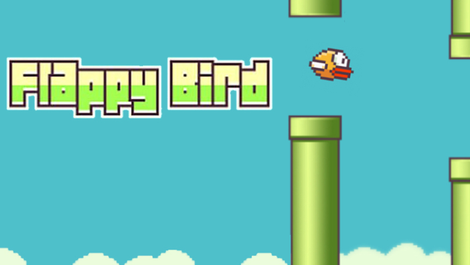

# VueJs Flappy bird 

Flappy Bird Game With VueJs Framework  : )

# Installation
To Install VueJs Use This Link : https://vuejs.org/guide/quick-start.html 

# Features
- VueJs 3.0
- 1 Pages included (index)
- No custom classes
- Easy to use
- Cross-browser compatibility (Chrome, Firefox, Opera, IE11, Safari)
- and more ...

# Report Some Bugs
Find a Bug? Please, [create an issue](https://github.com/YasinDehfuli/Flappy-Bird/issues) and we'll fix it together for a better template.

# Contribution
Contribution are always welcome and recommended! Here is how:

- Fork the repository ([here is the guide](https://help.github.com/articles/fork-a-repo/)).
- Clone to your machine git clone https://github.com/YOUR_USERNAME/Flappy-Bird.git
- Make your changes
- Create a pull request

# License
[GNU License](http://opensource.org/licenses/GNU)

---

Designed By <b>Nisay</b>! ❤️

